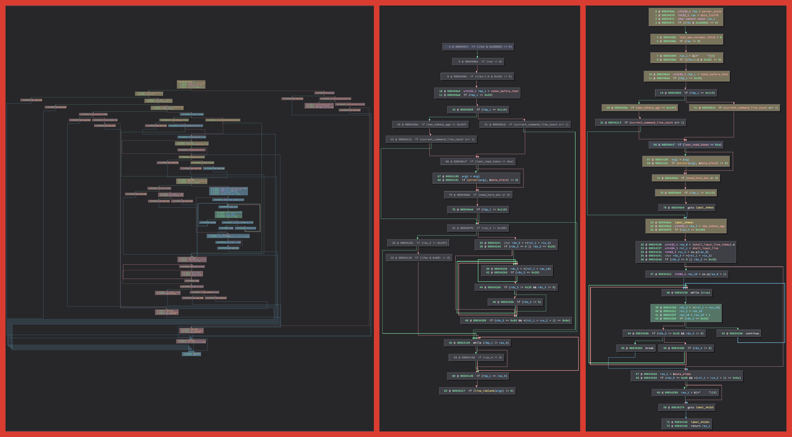

# Tantō
Author: **Vector 35, Inc.**

## Description:
Tantō is a plugin for [Binary Ninja](https://binary.ninja/) that slices functions so you can understand them faster.

For a more detailed explanation of what Tantō does, please check out [this blog post](https://binary.ninja/2022/06/20/introducing-tanto.html).

## Minimum Version

This plugin requires the following minimum version of Binary Ninja:

* 3.0.3223

## License

This plugin has been released under the [MIT license](./LICENSE.txt).

## Metadata Version

2
